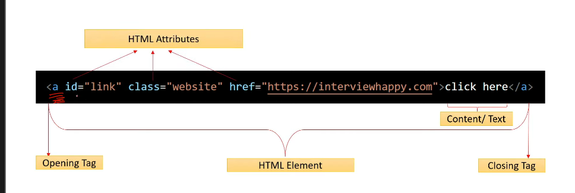

<!-- html attributes -->

<!-- html attributes and types -->

 it can provide additional information about HTML elements

 

<!-- types -->

1. common attributes - global attributes
    - eg: class,id,style,data
    - it is common and applicable for all the elements

2. specific attributes
    - href,src, alt, width,height,target,rel,typpe,value,name,placeholder,disabled,readonly,checked,selected
    - these are specific to the elements

<!-- what are id,style,class attributes of an element? and when to use -->

  ID  - id attributes is used to uniquely identify an element on a page

  STYLE - it allows you to apply inline styles directly to an individual element.

<!-- what are data attributes in html -->

    - Data attributes in HTML allow you to store extra information directly in an element without affecting its appearance or behavior. They start with data- followed by a custom name.

<!-- USE CASES -->
1. Storing extra metadata
2. Passing dynamic data to JavaScript
3. Enhancing interactivity without modifying the DOM structure

<!-- DOM Means -- Document Object Model -->
 The DOM is a programming interface that represents an HTML or XML document as a tree structure, where each element is a node. It allows JavaScript to interact with and modify the webpage dynamically.