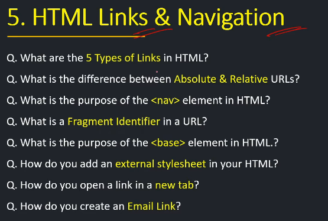

<!-- What are the 5 types of links in html -->

1. anchor link - Used to navigate to another webpage or section.

2. external resource link - Links external resources like CSS files or fonts.

3. image link - Uses an image as a link.

4. bookmark link -Navigates to a specific section using an id.

5. email link - Opens the default email app with a pre-filled address.
 
<!-- what is difference b/w absolute and relative URLs? -->

1. absolute url - it provides the complete web address of a source and it is used to link resources on different websites.

2. relative url -   it is used to specify the location of a resource in relation to the current document.
- url is not required
- it is used when linking to resources within the same website.

<!-- what is the purpose of the nav element in html
 -->
1. The <nav> element is used to define a section of navigation links in a webpage.

example :

<nav>
  <ul>
    <li><a href="home.html">Home</a></li>
    <li><a href="about.html">About</a></li>
    <li><a href="contact.html">Contact</a></li>
  </ul>
</nav>

<!-- purpose --> 

✅ Groups navigation links (like menus, sidebars).
✅ Improves webpage structure for search engines.
✅ Enhances user experience and accessibility.

<!-- fragment identifier -->

A fragment identifier is the part of a URL after #. It is used to navigate to a specific section within a webpage.

✅ Jumps to a specific section without reloading the page.
✅ Improves navigation within long pages.
✅ Used in single-page applications (SPAs)

<!-- what is the purpose of the <base> element in html? -->

  - the <base> element in html is used to specify a base url for relative URLs within a document.
  - the <base> element is typically placed within the <head> section.

 