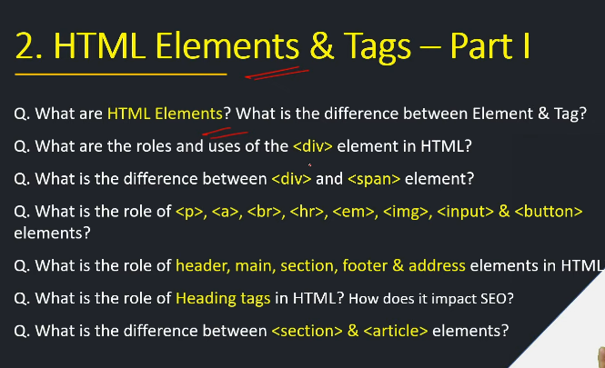
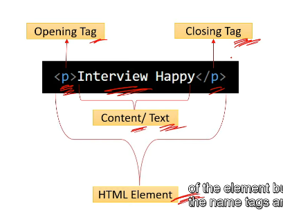

<!-- questions -->

<!-- html elements -->
 

    - html elements is a building blocks of web pages
    - it consist of start tag ,end and content
    - tag is a specific part of an elememt that  denotes the beginning or end of that element.

<!-- top 10 most common elememts -->

<!-- roles and uses of 
 element -->

div - is a container that is used to group and structure the content on a webpage.

uses of div :

1. grouping and structure content
2. styling and layout
3. scripting

<!-- diff b/w div and span -->

div - block level element
span - inline elememt

<!-- role of some tags -->

<!-- role of header,main,footer,section and address -->

<!-- role of heading tags -->
    - it is used to define the headings of section within a webpage

   

<!-- uses -->

1. organization & readability
2. serach engine optimization
3. styling and layout

<!-- Difference Between <article> and <section> in HTML -->

Both <article> and <section> are used for organizing content, but they have different purposes:

1️.  <article> → Independent content

It can stand alone and be shared separately.
Example: Blog post, news article, or forum post.
2️.  <section> → Divides content into parts

It groups related content together but is not independent.
Example: Different sections of a webpage like "About Us," "Services," etc.