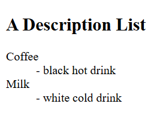

<!-- questions -->

[text](HTML_List&Tables.md)

<!-- types of list in html -->

1. ordered list - numbered or ordered
2. unordered list - marked with bullets
3. description list - list of terms with corresponding descriptions.

[text](HTML_List&Tables.md)

<!-- description_list -->

<!-- what is nested list -->

the list is placed within a another list items.

<!-- what are table,tr,th,td elements? adv & disadv? -->

HTML tables allow web developers to arrange data into rows and columns.
1. <tr> - "table row" which is used to define row in the table.
2. <th> - "table header" which is used to represent the column headers.
3. <td> - "table data" which is used to represent the cell in a table

<!-- adv -->

it is powerful tool for styling and displaying structured data

<!-- disadv -->

multiple column structure is not good for mobile devices - not responsive

<!-- colspan attribute -->

it is used to merge multiple cells horizondally into a single cell

its applicable i to <th> and <td> only.

<!-- what is the best way to add a border to a table,column and cell -->

setting the common style for table , tr,th and td then all the multiple tables in your webpage will follow consistent same style and format.

