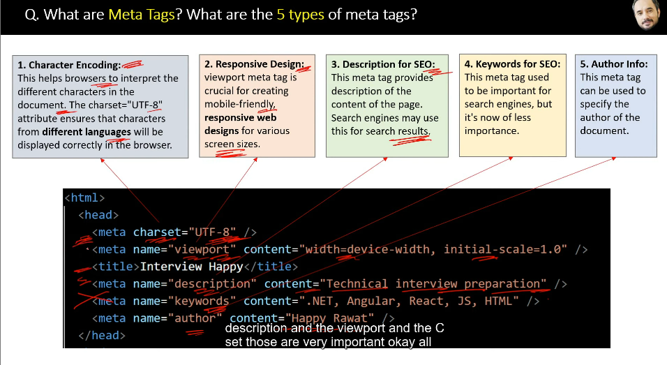

HTML - its  a markup language and its not a programming language
       it is used to create web pages. it is the structure of document using elements like paragraph,links,lists,headings.

<!-- diff b/w html and html5: -->
    -both are same but html5 is an updated version

<!-- adv of html5: -->
        - new semantic elements like nav,article,header
        - form input types <input type="date">,and email
        - audio and video supports
        - mobile compatibility
        - simple code 

<!-- XHTML AND HTML -->
        - xhtml is a combination of both xml and html
        - it follows the rules of xml define         the structure of web pages

html - lenient syntax  
xhtml - stricter syntax

html - not case sensitive
xhtml - case sensitive

html - supported all browsers
xhtml - limited support by browsers

<!-- DOCTYPE IN HTML -->
     - it is a doc type which specifies the version of HTML
     - It will tells the browser which version of html it is and shows how to interpret the code

<!-- what will happen if you remove doc type in your html -->

   - the browser can still render the page but they will not be able to validate the version of html. 

<!-- diff b/w head and body in html? and where to place js link reference? -->

<!-- HEAD -->
    - to place it in meta information 
<!-- meta information -->
    - information about the document
    - example: title,meta,link,script,style

<!-- BODY -->
    - To place the actual content of your html web page. for example 
,h1,p,img,a these are kept under body element

<!-- title -->
    - it is used to define the title of the web page
<!-- adv of title -->
1.  window title - displayed in tab of the browser.
2.  seo - search engines use the title as the main heading for search results.
3.  bookmarks/favorite - it is used as the default name of the bookmark
4.  social media sharing - it is used as the default title in shared post.

<!-- meta tags and its 5  types -->

<!-- 5 types -->

1. character encoding
2. responsive design
3. description for seo
4. keywords for seo
5. author info

<!-- seo -->
 
<!-- What is SEO? -->
SEO (Search Engine Optimization) is the process of improving a website to rank higher on search engines like Google. It helps websites get more visitors by making them easier to find when people search for related topics.

<!-- Example: -->
Imagine you have a website about healthy recipes. If you use SEO properly:
✅ Use the right keywords (e.g., "easy healthy breakfast")
✅ Write high-quality content that answers user questions
✅ Make your website fast & mobile-friendly
✅ Get links from other websites
