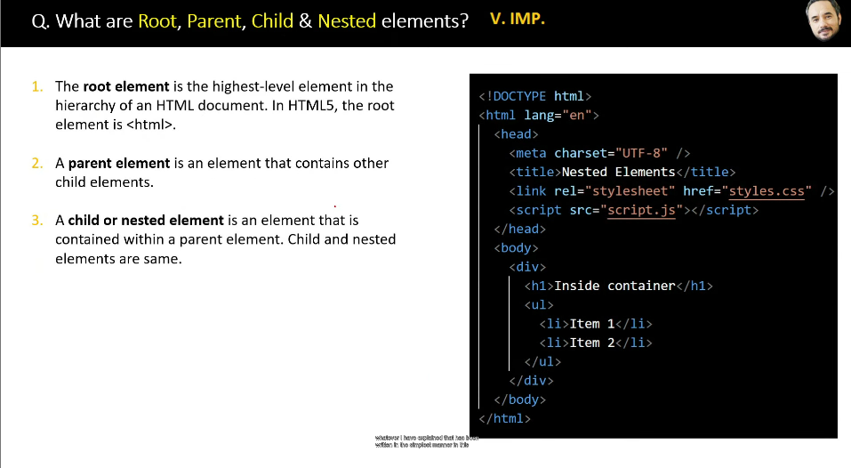
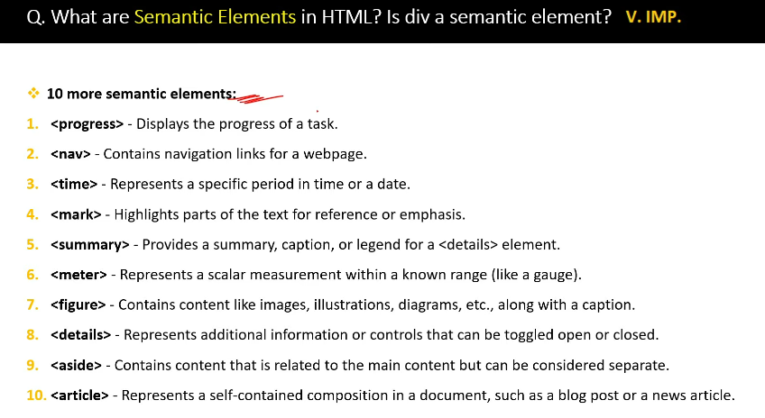

<!-- part 2 -->

<!-- root, parent child & nested elements -->

<!-- empty elements -->

An empty tag (also called a self-closing tag) is an HTML tag that does not have a closing tag and does not contain any content.

<!-- what are semantic elements in html? is div a sementic element? -->

    - Semantic elements are HTML tags that have a clear meaning about the content inside them. They help both browsers and developers understand the structure of a webpage.

<!-- eg: -->

    <header>   <!-- Defines the header of a page -->
<nav>      <!-- Navigation menu -->
<article>  <!-- Independent content like a blog  post-->
<section>  <!-- Groups related content -->
<footer>   <!-- Footer of a page -->

<!-- is div a sementic element?  -->
        -   No, 
 is NOT a semantic element.
            
 is just a generic container with no meaning about the content inside it.
            It is mainly used for styling and layout.

