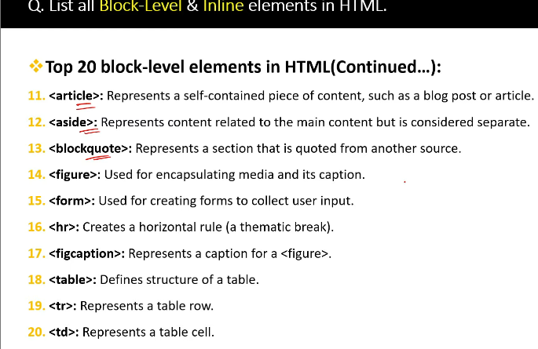

<!-- part 2 -->

<!-- root, parent child & nested elements -->

<!-- empty elements -->

An empty tag (also called a self-closing tag) is an HTML tag that does not have a closing tag and does not contain any content.

<!-- what are semantic elements in html? is div a sementic element? -->

    - Semantic elements are HTML tags that have a clear meaning about the content inside them. They help both browsers and developers understand the structure of a webpage.

<!-- eg: -->

    <header>   <!-- Defines the header of a page -->
<nav>      <!-- Navigation menu -->
<article>  <!-- Independent content like a blog  post-->
<section>  <!-- Groups related content -->
<footer>   <!-- Footer of a page -->

<!-- is div a sementic element?  -->
        -   No, 
 is NOT a semantic element.
            
 is just a generic container with no meaning about the content inside it.
            It is mainly used for styling and layout.

<!-- can HTML tags be written in Uppercase? -->

- yes, html tag is not case sensitive       therefore it can be written in uppercase,lowercase, or a combination of both

- but it is not recommmended as per standards

<!-- what are the 3 diff b/w block-level and inline elements? -->

<!-- block level -->

1. creates "blocks" of content
2. starts on new line
3. takes up the whole line 
4. eg: div,p,h1,ul,li,table,form

<!-- inline elements -->

1. inline elements length depends on their content length
2. does not start on new line
3. cannot set width & height for inline
4. eg: span,a,strong,em,img ,input,br

<!-- 20 block level elements -->

