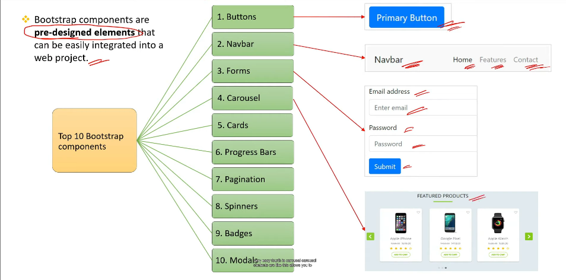
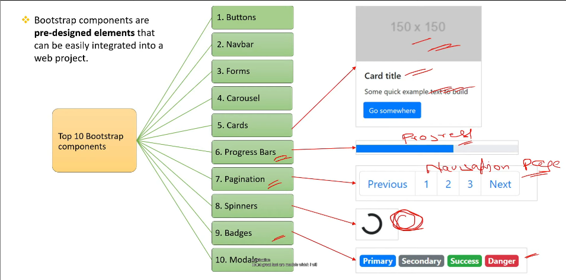

<!-- what is bootstrap and what are the 5 responsive design framework? -->

it is a popular open source front end framework which provides responsive and mobile-first css.

1. Bootstrap – Most widely used, includes a flexible grid, components, and utilities.
2. Foundation – Developed by Zurb, provides flexible grids and mobile-first design.
3. Bulma – Uses flexbox-based layout with simple class-based styling.
4. Tailwind CSS – A utility-first framework that allows customized styling without writing extra CSS.
5. Materialize – Based on Google's Material Design, provides a modern UI look.

<!-- adv of bootstrap -->

1. rapid development
2. responsive design
3. cross browser compatibility
4. large community and support
5. accessibility

<!-- 2 ways to include bootstrap framework for your website -->

1. put the link of bootstrap CDN-Content Delivery Network in head section

2. download the bootstrap files and add them locally in your html document.

<!-- explain the grid system in bootsrap -->

grid system is 12 column layout and is designed to adapt to various screen sizes.

<!-- what is the diff between col-xs,col-sm,col-md,col-lg & col- xl -->

1. col-xs-* (Extra Small) → Used for very small screens (mobile) below 576px. (Deprecated in Bootstrap 4)
2. col-sm-* (Small) → Works for screens ≥576px, commonly used for mobile devices.
3. col-md-* (Medium) → Applies to screens ≥768px, suitable for tablets.
4. col-lg-* (Large) → Used for screens ≥992px, ideal for laptops.
5. col-xl-* (Extra Large) → Targets screens ≥1200px, meant for large desktops.

<!-- How it Works: -->
    - On small screens (≥576px), it takes 6 columns (half width).
    - On medium screens (≥768px), it takes 4 columns (one-third width).
    - On large screens (≥992px), it takes 3 columns (one-fourth width).

<!-- What are bootstrap components?what are top 10 bootstrap components? -->

refer this images for components and its structures.

